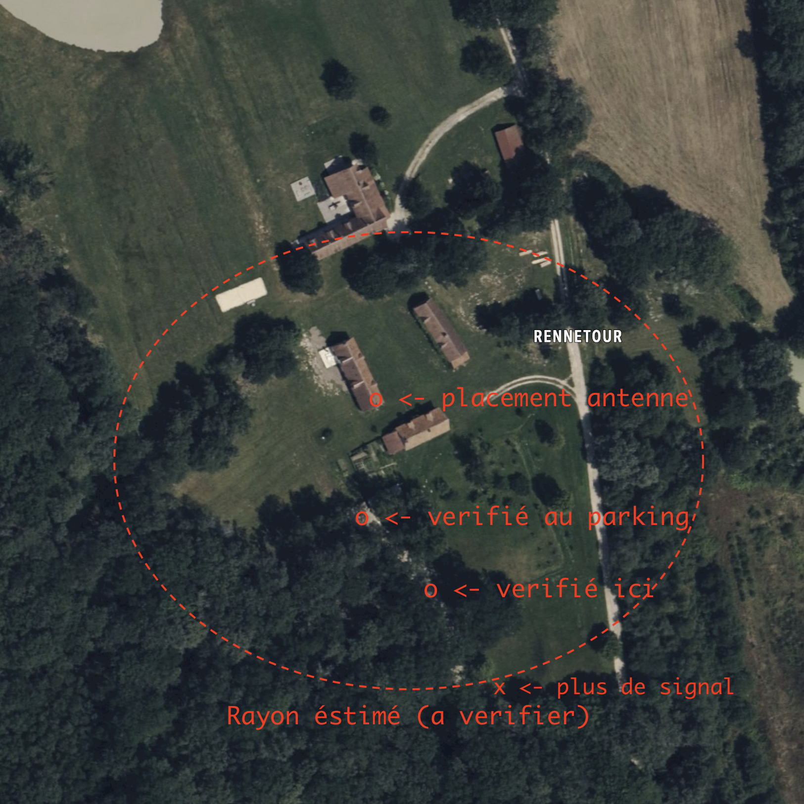
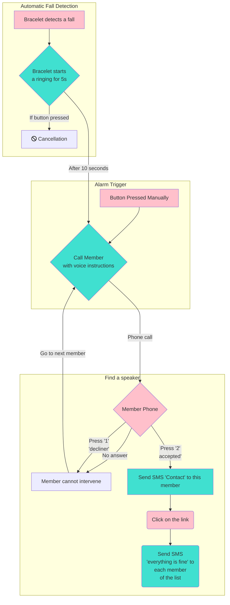
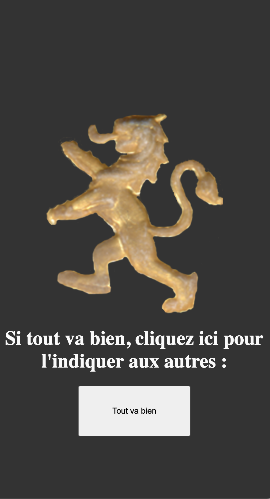

# Documentation for Marie-Françoise de Pitray's alert system

## 1. Request:
To allow a comfortable autonomy to Marie-Françoise, while keeping security against falls or discomfort that could become much more serious than necessary.

**To have an "invisible" solution, we looked for an element that:**

- *Can be worn during any activity, even underwater (shower, cooking, etc.),*
- Does not need to be removed to recharge *(batteries last for 6 months of 10 times a day use)*
- *Automatically detects falls, and can trigger an alarm on its own (with option to cancel in case of accidental activation),*
- *Sufficient range to cover the parking lot behind the house.*
## 2. Estimated radius of effectiveness:
 

## 3. System behavior:

1. Marie-Françoise is the first to be called, who can:
    - *Confirm that the system has started (if she hears her phone ringing)*
    - *Allow to cancel the call in case of error.*
    - *If no response from him, the alert continues as planned.*
2. The system will initiate calls in **sequence**, trying to reach each member before moving on to the next, **even if the member does not answer.**
3. The system will **repeat the list in a loop** until it finds a member who *accepts to take charge of the situation.*

## 4. Agree to intervene

By pressing "1" during a call, you take charge of the situation. From this moment, there will be no more automatic actions, the system will stop calling in sequence, etc.

**You don't have to be there to agree - just have the willpower to take charge, and call others and/or the fire department to get things done.**

## 5. Ok, I accept. What now ?

If you're able to get around the farm, that's a surefire way to check out what's going on. Otherwise, you can start calling others who might be able to do so.

To this end, you will receive an accompanying message like this, with contact information for other people in the area or who may be affected:

- link ->

*At the bottom of the SMS is a link that redirects to our website, which allows you to notify others that the situation is resolved*

## 7. Further?

Other planned features:
- Ability to send these messages/calls via **WhatsApp**
- Possibility to add a link to a **WhatsApp** group to facilitate communication
- Possibility to answer / send an SMS to the number of the alert system for redistribution to everyone.
- Add an answering machine with information / automatic SMS sending if call back