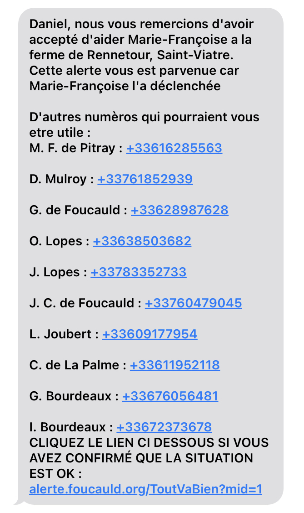

# Documentation pour systeme alèrte de Marie-Françoise de Pitray

## 1. Objectif :
Pour permettre une autonomie confortable a Marie-Françoise, tout en gardant une sécurité contre des chutes ou des malaises qui pourraient entrainer de graves répercutions.

**Pour avoir une solution "invisible", nous avions cherché un élément qui :**

- *Peut se porter constament, meme sous/dans l'eau (douche, cuisine, etc.),*
- *N'a pas besoin d'être recharger* *(les piles durent pendant 6 mois d'utilisation quotidienne)*
- *Détecte automatiquement les chutes, et peut déclencher une alarme tout seul (avec option d'annulation en cas d'activation accidentelle),*
- *Une portée suffisante pour couvrir jusqu'au parking derriere la maison.*

## 2. Rayon éstimé d'éfficacité :
 

## 3. Le comportement du systeme :

1. Marie-Françoise est la premiere a être appellée, ainsi elle peut :
   - *Confirmer que le systeme s'est mis en route (en entendant son téléphone sonner)*
   - *Annuler l'appel en cas d'erreur.*
   - *Si pas de réponse de sa part, l'alerte continue comme prévu.*
2. Le systeme déclenchera des appels en **sequence** , en essayant de joindre chaque membre avant de passer au suivant, **meme si le membre ne répond pas.**
3. Le systeme **répétera la liste en boucle** jusqu'a trouver un membre qui *accepte de prendre en charge la situation.*

## 4. Accepter d'intervenir

En appuyant sur "1" lors d'un appel, vous prenez en charge la situation. A partir de ce moment, il n'y aura plus d'actions automatiques, le système cessera d'appeller en sequence, etc.

**Vous n'êtes pas obligé d'être sur place pour accepter - il suffit d'avoir la volonter de prendre en main la situation, et appeller d'autres et/ou les pompiers pour faire avancer les choses.**

## 5. Ok, j'accepte. Quoi maintenant ?

Si vous êtes en mesure de vous déplacer a la ferme, c'est un moyen sur de verifier ce qu'il se passe. Sinon, vous pouvez commencer a appeller des autres qui serait susceptibles a pouvoir le faire.

A cet effet, vous recevrez un message d'accompagnement comme ceci, avec les informations pour contacter d'autres gens dans la région ou qui pourrait être concernées :

- lien ->   

*En bas du SMS se figure un lien qui redirige vers notre site web, qui permet de signaler aux autres que la situation est réglée*

## 7. Plus loin ?

D'autres fonctionalitées envisagées :
- Possibilité d'envoyer ces messages/ces appels via **WhatsApp**
- Possibilité de rajouter un lien vers un groupe **WhatsApp** pour faciliter la communication
- Possibilité de répondre/envoyer un SMS au numèro du systeme d'alerte pour redistribution a tout le monde.
- Rajouter un répondeur avec des informations/l'envoi du SMS automatique si rappel

